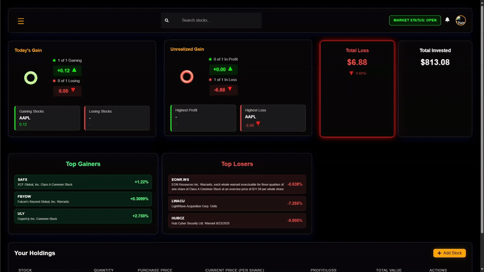
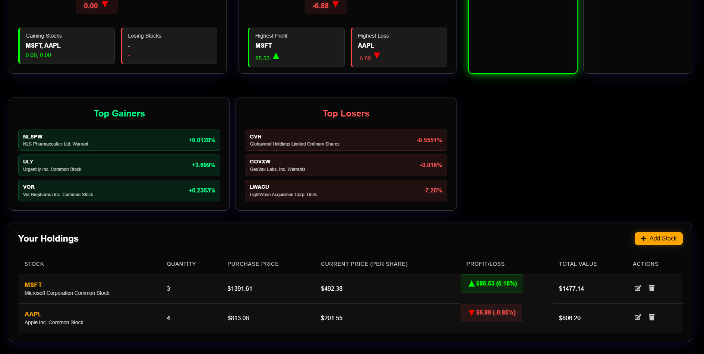
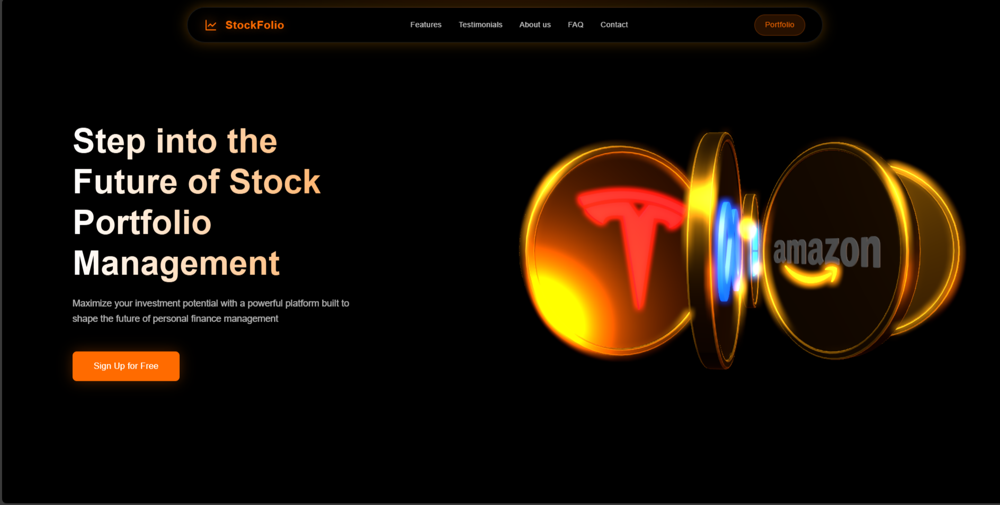

# 📈 Stoxly (Stock Market Portfolio Tracker)

[](https://react.dev/) 
[](https://nodejs.org/) 
[](https://expressjs.com/) 
[](https://www.mongodb.com/) 
[](https://jwt.io/) 
[](https://alpaca.markets/) 
[](https://threejs.org/)

---

## 🌐 Deployment

- 🔗 [Live Site (Frontend)](https://stoxly.netlify.app)

---

## 🎥 Demo



---

## 📸 Screenshots

### 📊 Portfolio Dashboard


### 🎮 3D Landing Page


---

## 📝 Overview

Tracking stock investments manually can be challenging, leading to difficulties in monitoring profits/losses, retrieving historical data, and visualizing market trends?

**Stoxly** is a modern full-stack web application designed to help users manage and analyze their stock investments with ease. By integrating real-time stock data, interactive dashboards, and 3D visuals, it delivers a robust experience for both beginners and experienced traders.

---

## ✨ Features

- 🔐 **Secure Authentication** – User login and registration powered by JWT.
- 📊 **Portfolio Dashboard** – Add, update, and remove stocks in a personal portfolio.
- 📈 **Live Market Data** – Real-time stock prices and updates via Alpaca API and WebSocket.
- 📉 **Analytics & Insights** – Visualize profits, losses, and historical trends.
- 🌐 **3D Interactive UI** – Engaging, animated elements and charts powered by Three.js.
- 📰 **Market News** – Stay updated with top headlines and movers in the stock market.

---

## 🛠️ Tech Stack

### Frontend
- [React.js](https://react.dev/)
- CSS 

### Backend
- [Node.js](https://nodejs.org/)
- [Express.js](https://expressjs.com/)
- [MongoDB Atlas](https://www.mongodb.com/cloud/atlas)
- JWT Authentication
- WebSocket for real-time data

### APIs & Services
- [Alpaca API](https://alpaca.markets/) – Real-time stock data
- [TradingView](https://www.tradingview.com/) – Optional charting integration

### Visualization
- [Three.js](https://threejs.org/) – 3D interactive visuals

---

## Getting Started

### Prerequisites
- Node.js & npm
- MongoDB Atlas account
- Alpaca API key (go [here](https://alpaca.markets/) for keys)

### Installation
1. **Clone the repository:**
   ```bash
   git clone https://github.com/kalviumcommunity/S64_DivyanshuVerma_Capstone_Stoxly.git
   cd S64_DivyanshuVerma_Capstone_Stoxly
   ```
2. **Install dependencies:**
   ```bash
   cd backend && npm install
   cd ../frontend && npm install
   ```
3. **Set up environment variables:**
   - Create `.env` files in `backend` directory (see `.env.example`).
4. **Run the application:**
   - Start backend:
     ```bash
     cd backend && npm run dev
     ```
   - Start frontend:
     ```bash
     cd frontend && npm run dev
     ```

## Usage
- Register or log in to your account.
- Add stocks to your portfolio and track their performance in real time.
- Explore interactive charts and 3D visualizations.
- Stay informed with live news and market movers.

## Contributing
Contributions are welcome! Please open issues or submit pull requests for improvements, bug fixes, or new features.

## License
This project is licensed under the MIT License.
